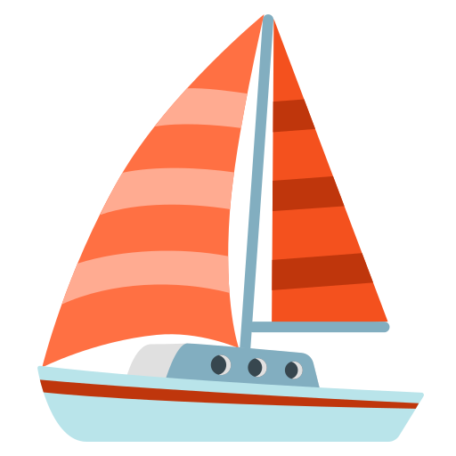

<Image src="journal.jpg" width={800} height={500} />

# Heading (rank 1)

<Callout>This is a default callout</Callout>

<Callout type="warning">This is a warning callout</Callout>

<Callout type="danger">This is a danger callout</Callout>

## Heading 2

### 3

#### 4

##### 5

###### 6

> Block quote

- Unordered
- List

1. Ordered
2. List

A paragraph, introducing a thematic break:

---

```js
some.code()
```

a [link](https://example.com), an , some _emphasis_,
something **strong**, and finally a little `code()`.

# GFM

## Autolink literals

www.example.com, https://example.com, and contact@example.com.

## Footnote

A note[^1]

[^1]: Big note.

## Strikethrough

~one~ or ~~two~~ tildes.

## Table

| a   | b   |   c |  d  |
| --- | :-- | --: | :-: |

## Tasklist

- [ ] to do
- [x] done
